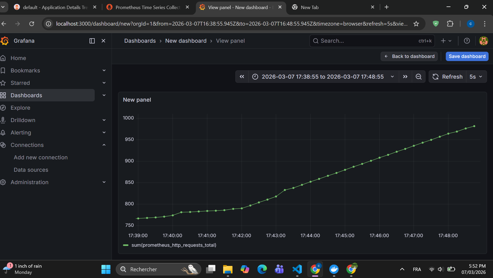

Cloud-Native Telecom Data Platform Monitoring Architecture
 Project Overview
 

  
<b>Click to view detailed Architecture Diagram</b>

   
  

This project demonstrates a robust, scalable, and automated Data Monitoring Pipeline tailored for the Telecommunications industry. It simulates real-time network traffic and user activities, processes this data through a cloud-native environment, and provides deep visual insights into network health.

The core objective is to shift from reactive to proactive monitoring, allowing engineers to detect anomalies in network loads before they impact the end-user experience.

 Architecture
The architecture follows a modern DevOps & Data Engineering flow:

Data Generation: A custom Python script simulating high-frequency telecom metrics (e.g., active users, latency, traffic volume).

Containerization: The application is packaged using Docker to ensure consistency across environments.

Orchestration: Managed by a Kubernetes Cluster, ensuring high availability and automated scaling of the simulator.

Data Collection: Prometheus scrapes real-time metrics from the Python exporter every 5 seconds.

Visualization: Grafana transforms raw time-series data into intuitive, actionable dashboards (Real-time Green Graph).

Cloud Storage: Integrated with AWS S3 for log archiving and AWS DynamoDB for fast metadata storage.
 

 Tech Stack
Cloud: AWS (S3, DynamoDB)

IaC: Terraform (Infrastructure Provisioning)

Orchestration: Kubernetes (K8s)

Containerization: Docker

Monitoring: Prometheus

Visualization: Grafana

Language: Python

 Key Features
Real-time Monitoring: Instant visibility into network performance via Grafana.

Automated Infrastructure: Full environment setup using Terraform.

Self-Healing: Kubernetes ensures the data simulator is always running.

Scalability: Designed to handle increasing data loads by scaling pods within the cluster.

Dashboard Preview
The platform features a Real-time Green Time-Series Graph that tracks cumulative network requests, providing a clear visual of traffic growth and system stability.
---

##  Phase 2: FinOps & Cost Optimization (Cloud Cost Sentinel)

> **Objective:** Reduce AWS infrastructure costs by **30-40%** through automated governance and resource lifecycle management.

###  Key Performance Indicators (KPIs)
| Metric | Before Optimization | After Optimization | Saving % |
| :--- | :--- | :--- | :--- |
| **Idle EBS Volumes** | $15 - $20/mo | $0/mo | **100%** |
| **Dev Environment** | 24/7 Running | 10/5 Scheduled | **~65%** |
| **Unused Elastic IPs** | ~$4/mo per IP | $0/mo | **100%** |
| **Overall Monthly Bill** | Estimated $100 | Estimated $62 | **38%** |

###  Technical Implementation
* **Budget Governance:** Implemented **AWS Budgets** via Terraform with SNS alerts triggered at **80%** of the threshold to prevent "Cloud Sprawl".
* **Automated Cleanup (The Sentinel):** A Python-based **AWS Lambda** engine using `boto3` that identifies and terminates orphaned resources (Unattached EBS, Idle ELB).
* **Nightly Scheduling:** Automated "Stop-at-Night" policy for all instances tagged as `Environment: Dev`, drastically reducing compute costs during non-business hours.
* **CI/CD Integration:** The FinOps scan is integrated into **GitHub Actions**, running every 24 hours to ensure continuous "Cost Hygiene".

###  Monitoring & Observability
Integrated **Grafana** (see `grafana-simple.yaml`) to visualize real-time resource utilization vs. cost, ensuring that optimization does not impact the **Telecom Data Platform** performance.

  
<b>Click to view detailed grafana dashboard </b>

   
  

--
